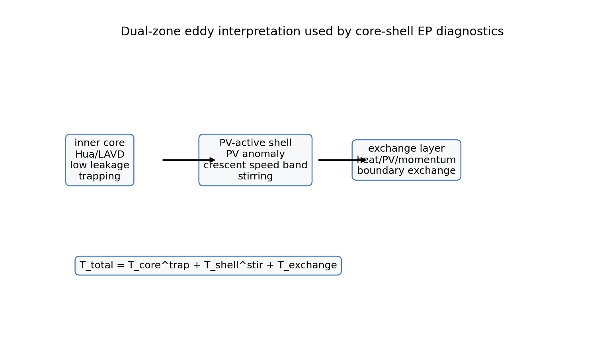
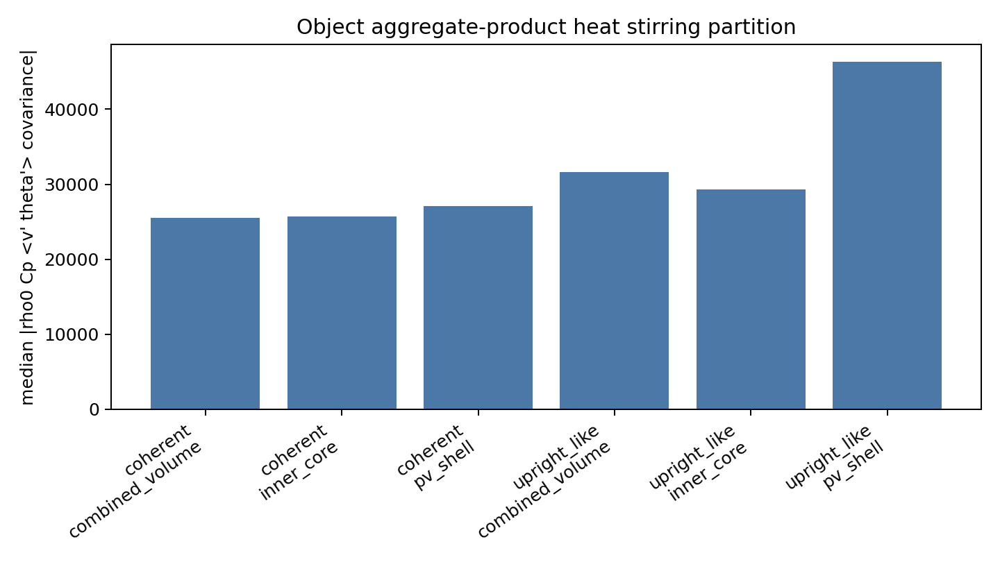
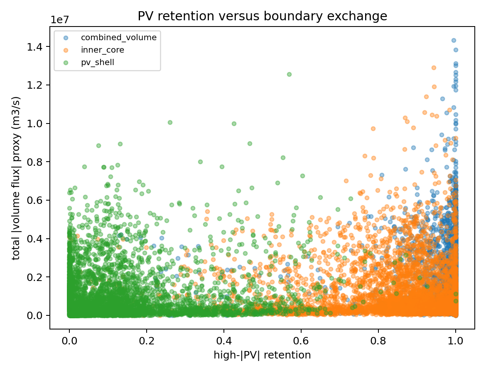

# Core-Shell / PV-Active Shell EP 分区理论说明

生成日期：2026-09-05  
项目口径：Kuroshiou 1/24 deg 局地亚网格中心，boundary-monotonic，strict-contiguous，life30，coherent/upright_like，ME_LIUTEX azimuth-preserved，global_ls_alpha TURN。

## 摘要

我们现在不再把一个中尺度涡旋强行看成单一、封闭、同时负责 trapping、stirring、PV anomaly 和 EP forcing 的材料体。现有诊断显示，Hua 弱速中心与 LAVD 旋转相干中心较接近，而 PV anomaly core 存在系统性偏离。与此同时，热通量、PV 通量和 EP 倾斜修正并不都集中在低泄漏的 inner core 内，而是相当一部分出现在外侧 PV-active shell。

因此，更合理的理论框架是双区结构：

\[
\mathcal{T}_{total}
=
\mathcal{T}_{core}^{trap}
+
\mathcal{T}_{shell}^{stir}
+
\mathcal{T}_{exchange}.
\]

其中 inner core 表示低泄漏、旋转相干、接近材料保持的涡核；PV-active shell 表示围绕内核的 PV anomaly、强剪切、月牙状强速带和协方差 stirring 活跃区；exchange layer 表示两者之间不可忽略的热、PV、浮力和动量交换。

## 1. 为什么 single material eddy volume 不够用

最初的想法是寻找一个严格材料体 \(M\)，让涡旋输送可以写成单个封闭控制体内的 EP forcing 或通量预算。但我们的验证出现了三个信号：

1. 材料边界 leakage 不能忽略。即使把边界从阈值 mask 推进到 active/level-set/Lagrangian proxy，边界通量仍然不为零。
2. 曲管几何小曲率前提失败。thin curved tube 的 metric/Jacobian/Christoffel 解释需要 \(\epsilon_{\kappa}=\kappa r \ll 1\)，而我们的结果中 \(\epsilon_{\kappa}\) 中位数约为 10-35，metric valid fraction 的中位数为 0。
3. PV core 与 LAVD/Hua core 不共位。LAVD 能找到旋转相干核，Hua 能找到弱速/速度几何中心，但 PV anomaly 最大区经常偏在 shell 或边界交换区。

这说明，闭合失败未必是 EP 公式本身错误，而是“一个边界同时圈住材料相干核与 PV 动力核”的假设过强。

图 1 给出了当前双区结构的工作图像。这个图的意义不是替代严格材料体理论，而是把涡旋拆成三个可分别诊断的物理对象。

## 2. 三类中心和核心

### 2.1 Hua 弱速中心

Hua 中心来自速度场几何：在局地速度异常场中寻找弱速核，并通过切向性、两侧反转、boundary-monotonic 等条件筛选。它强调的是速度几何与旋转结构的可识别性。

### 2.2 LAVD 旋转相干中心

LAVD 中心来自有限时间粒子轨迹上的涡度偏差积分：

\[
\mathrm{LAVD}_{t_0}^{t_1}(x_0)
=
\int_{t_0}^{t_1}
\left|\zeta(x(t;x_0),t)-\overline{\zeta}(t)\right|dt .
\]

Haller 等人的 LAVD 方法强调客观旋转相干性。它适合定义材料旋转核，但不保证包含 PV anomaly 的主要极值。

### 2.3 PV anomaly core

PV core 是动力核心，代表 \(q'\) 或 PV proxy 的主要异常区。若背景剪切、倾斜、密度结构或月牙状强速带显著，PV core 可以偏离弱速中心和 LAVD 中心。

这一分离是双区模型的起点：运动学旋转核不必等于动力 PV 核。

## 3. 分区模型定义

我们定义三个区域。

**inner core**：围绕 Hua/LAVD 近同位中心的低 leakage 区域。它的主要物理意义是 trapping 和 material coherence。

**PV-active shell**：围绕 inner core 的外壳，包含较强 PV anomaly、强剪切、非轴对称月牙状速度带。它的主要物理意义是 stirring、协方差输送和倾斜修正。

**exchange layer**：inner core 与 PV-active shell 的界面。若该界面上的边界热/PV/动量通量不小，就不能把 inner core 单独视作完整输送闭合体。

对应的总输送分解为：

\[
\mathcal{T}_{total}
=
\mathcal{T}_{core}^{trap}
+
\mathcal{T}_{shell}^{stir}
+
\mathcal{T}_{exchange}.
\]

这里的重点是：\(\mathcal{T}_{core}^{trap}\) 和 \(\mathcal{T}_{shell}^{stir}\) 是不同物理机制，不能因为二者都属于“涡旋”就用一个平均代表涡相乘来代替。

## 4. 热/PV stirring 必须用 aggregate-product

热输送和 PV 输送使用乘积后平均，而不是平均后乘积：

\[
H_M^{stir}
=
\rho_0 C_p
\left\langle v_{rot}'\theta' \right\rangle_M ,
\]

\[
P_M^{stir}
=
\left\langle v_{rot}'q' \right\rangle_M .
\]

同时输出失败对照：

\[
\left\langle vX \right\rangle_M,\quad
\left\langle v \right\rangle_M
\left\langle X \right\rangle_M,\quad
\mathrm{Cov}_M(v,X)
=
\left\langle vX \right\rangle_M
-
\left\langle v \right\rangle_M
\left\langle X \right\rangle_M ,
\]

其中 \(X=\theta'\) 或 \(q'\)。如果只用平均代表涡的 \(v\) 和 \(\theta/q\) 相乘，就会丢掉协方差输送。

图 2 显示 object-day aggregate-product 热通量分区。coherent 中 heat stirring 接近 core/shell 分担；upright_like 中 shell 占比更高。

图 3 显示 PV stirring 分区。PV covariance 更偏向 PV-active shell，说明 PV 动力输送并不主要由低泄漏 inner core 单独承担。

## 5. 普通垂向 EP flux 与倾斜坐标修正

在局地轴向坐标中，把水平扰动速度分解为沿轴方向 \(u_s'\) 和法向方向 \(u_n'\)。普通垂向 EP flux 可写为：

\[
F_z^{ordinary}
=
\rho_0 f_0
\frac{\left\langle u_n' b' \right\rangle}{N^2}.
\]

当涡旋中心线倾斜时，真正沿倾斜涡旋坐标的垂向导数不等于欧拉固定 \(z\) 方向导数。设中心线为 \(\mathbf{r}_c(z)\)，则倾斜坐标中的垂向变化包含：

\[
\partial_z^{tilted}
=
\partial_z
-
\frac{d\mathbf{r}_c}{dz}\cdot\nabla_h .
\]

因此可把倾斜坐标 EP flux 写成：

\[
F_z^{tilted}
=
F_z^{ordinary}
+
F_z^{tilt\ correction}.
\]

我们的全生命周期 EP 验证显示：

\[
\mathrm{median}
\left(
\frac{|F_z^{tilt\ correction}|}{|F_z^{ordinary}|}
\right)
\approx 0.47,
\]

p25-p75 约为 0.32-0.62，最大可超过 1。这说明倾斜修正不是小量；若用倾斜涡旋坐标，热/浮力相关的垂向 EP flux 会被明显改写。

图 4 显示 EP 倾斜修正的 core-shell 分区。绝对贡献更偏 shell，说明 tilt correction 的主要信号并不只来自低泄漏材料核。

## 6. Exchange layer 为什么必要

若 inner core 是严格材料体，边界法向通量应足够小。但我们看到 core-shell interface 和总边界通量都不为零。对热、PV、浮力和动量而言，这意味着边界交换不能被塞进单一“内部 EP forcing”里。

边界预算应单独写为：

\[
\mathcal{B}_{heat}
=
\oint_{\partial M}
\rho_0 C_p \theta' u_n\,dS ,
\]

\[
\mathcal{B}_{PV}
=
\oint_{\partial M}
q' u_n\,dS ,
\]

\[
\mathcal{B}_{mom,i}
=
\oint_{\partial M}
u_i' u_n\,dS .
\]

因此闭合残差应被理解为：

\[
R_{closure}
=
\left|
\mathcal{F}_{interior}^{EP}
+
\mathcal{B}_{exchange}
\right| .
\]

如果 \(R_{closure}\) 不下降，不能简单调边界到“看起来更封闭”；更可能说明 PV-active shell 和 inner material core 是两个不同物理区。

图 5 显示 exchange budget 的必要性。它提醒我们：低 leakage core 可以用于 trapping 解释，但不能自动代表全部热/PV/动量输送。

图 6 显示 PV retention 与 boundary exchange 的关系。若提高 PV retention 的同时 leakage 或 exchange 增大，则支持“PV 动力核不完全属于低泄漏旋转材料核”的解释。

## 7. 与文献的关系

Haller 与 Beron-Vera 的 geodesic eddy 理论强调有限时间低拉伸的闭合材料边界；LAVD 理论强调客观旋转相干核。这两类方法都很适合定义 inner material core，但它们并不要求 PV anomaly core 必须被同一个边界完全包住。

Abernathey 与 Haller 对 eastern Pacific 的研究提醒：Eulerian eddy 与 Lagrangian coherent vortex 并不等价，许多表观涡输送会被 filamentation 和 leakage 削弱。这个结论与我们现在的 exchange layer 解释一致。

Hausmann 与 Czaja、Dong 等关于 eddy heat transport 的工作说明，热输送本质上来自速度与温度异常的协方差。Chelton 等和 Frenger 等给出的全球/南大洋涡旋统计，则说明“涡旋结构”和“涡旋输送”不能混为一个量。

Yang/Xu/Li 2026 的模态倾斜结论说明，垂向倾斜可以由第一、第二斜压模态传播差异产生。我们的结果进一步指出：在 Kuroshiou 的速度中心和代表涡框架下，倾斜修正会明显改写 EP 垂向通量；但由于 PV core 与旋转材料核分离，不能直接用单一材料体闭合来解释全部 PV/热输送。

## 8. 当前判定

当前最稳健的正结果是：

1. 倾斜坐标修正不是小量，约为 ordinary vertical EP flux 的一半量级。
2. PV stirring 和 EP tilt correction 更偏向 PV-active shell。
3. heat stirring 在 coherent 中接近 core/shell 分担，在 upright_like 中更偏 shell。
4. thin curved tube 的 metric/Jacobian/Christoffel 项不能强解释，因为小曲率条件失败。
5. single material volume 不是当前最合适的理论框架；core-shell-exchange 是更符合结果的解释框架。

## 9. 下一步验证

下一步应围绕三件事继续：

1. 在 object-level 上验证 inner core 的 particle retention、LAVD/geodesic boundary 和 leakage。
2. 在 PV-active shell 中继续做 aggregate-product heat/PV/momentum moments，确认 shell 是否稳定承载主要 stirring。
3. 把 exchange layer 的 boundary heat/PV/momentum flux 与 interior EP forcing 分账，判断闭合残差来自边界交换、PV proxy、浮力口径，还是缺失三维通量项。

如果这些验证成立，我们后续论文叙述应从“一个倾斜材料涡旋的 EP 闭合”改成“倾斜涡旋的材料核、PV-active 外壳与交换层共同决定热/PV/动量输送”。

## References

- Haller, G. and Beron-Vera, F. J. (2013). Coherent Lagrangian vortices: the black holes of turbulence. Journal of Fluid Mechanics. DOI: 10.1017/jfm.2013.391.
- Haller, G., Hadjighasem, A., Farazmand, M., and Huhn, F. (2016). Defining coherent vortices objectively from the vorticity. Journal of Fluid Mechanics. DOI: 10.1017/jfm.2016.151.
- Abernathey, R. and Haller, G. (2018). Transport by Lagrangian Vortices in the Eastern Pacific. Journal of Physical Oceanography. DOI: 10.1175/JPO-D-17-0102.1.
- Chelton, D. B., Schlax, M. G., and Samelson, R. M. (2011). Global observations of nonlinear mesoscale eddies. Progress in Oceanography. DOI: 10.1016/j.pocean.2011.01.002.
- Hausmann, U. and Czaja, A. (2012). The observed signature of mesoscale eddies in sea surface temperature and the associated heat transport. Nature Communications. DOI: 10.1038/ncomms1595.
- Dong, C., Zhang, Y., Gille, S. T., et al. (2014). Global estimates of oceanic mesoscale eddy heat and salt transports from Argo and altimetry. Nature Communications. DOI: 10.1038/ncomms4294.
- Frenger, I., Munnich, M., Gruber, N., and Knutti, R. (2015). Southern Ocean eddy phenomenology. Journal of Geophysical Research: Oceans. DOI: 10.1002/2015JC011047.
- Greatbatch, R. J. (1998). Exploring the relationship between eddy-induced transport velocity, vertical momentum transfer, and the isopycnal flux of potential vorticity. Journal of Physical Oceanography. DOI: 10.1175/1520-0485(1998)028<0422:ETRBEI>2.0.CO;2.
- Yang, Z., Xu, F., and Li, H. (2026). Understanding the Mesoscale Eddy Vertical Tilt Based on Mode Decomposition. Local PDF.
- 项目内部文档：E-P_flux理论整理.pdf；curved_tube_ep_flux.pdf；large_curvature_material_volume_ep_flux.pdf。
