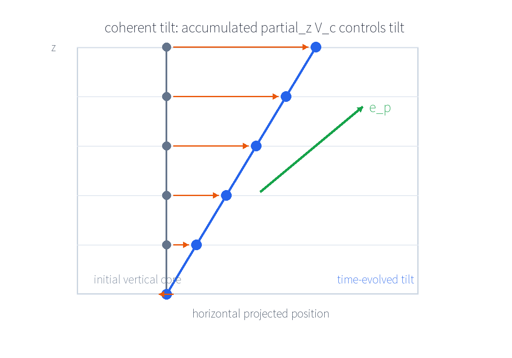
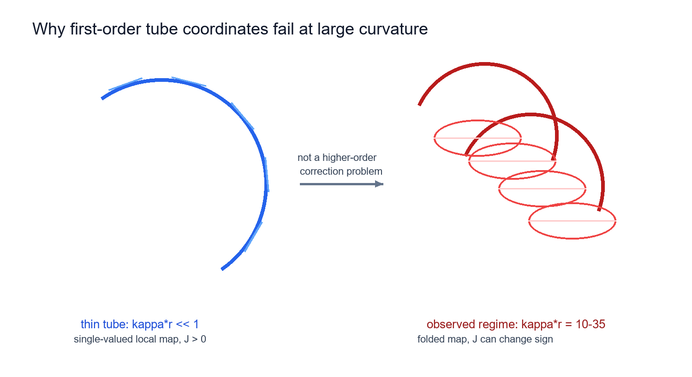
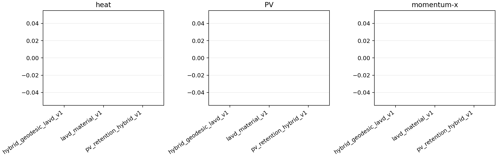
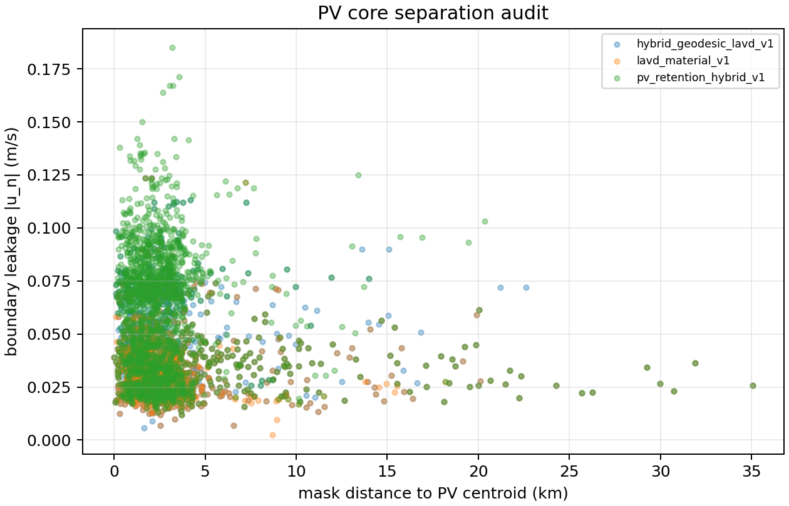
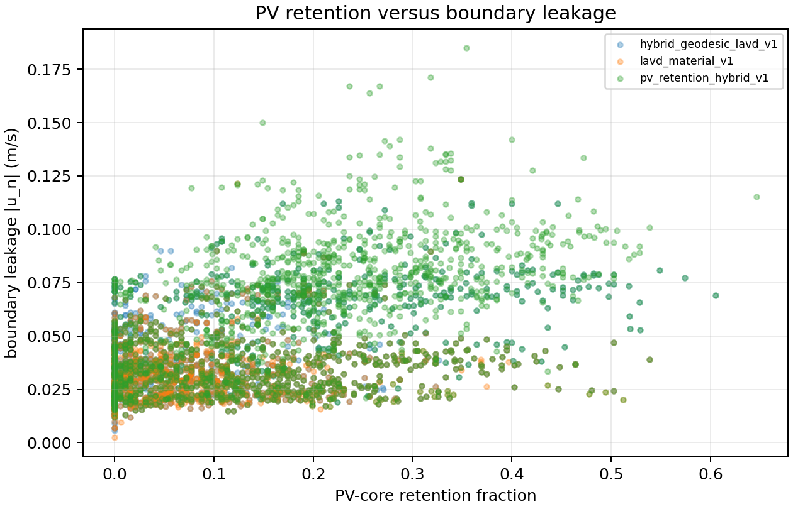
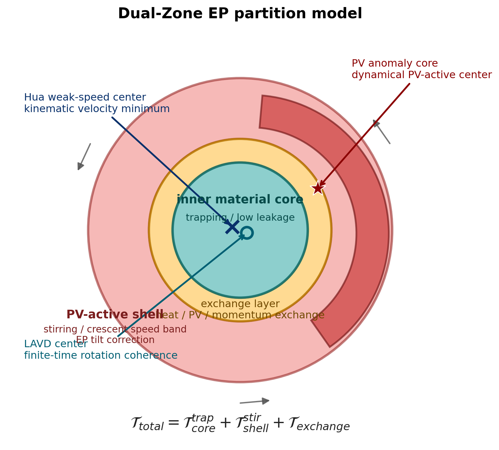
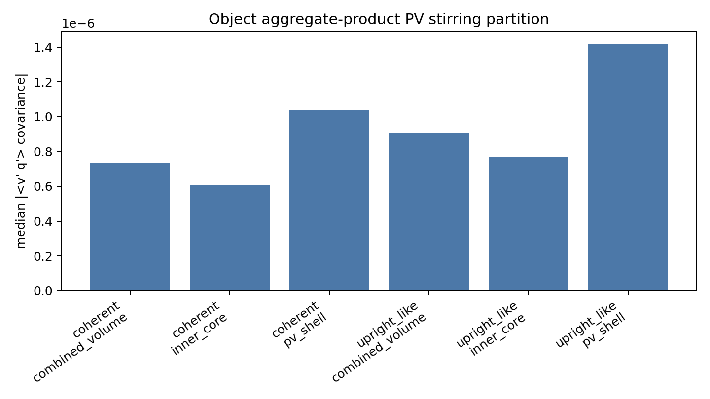
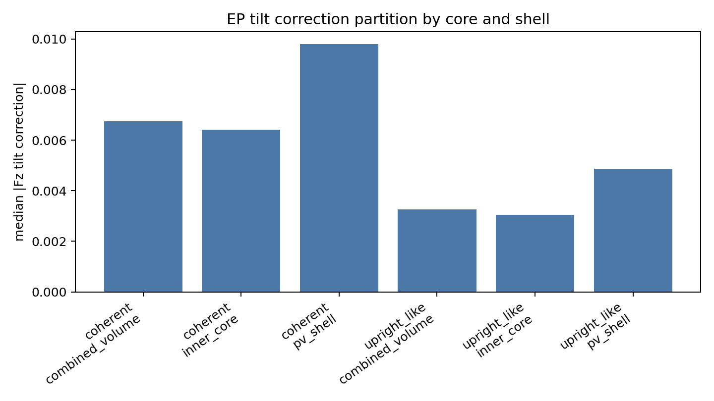
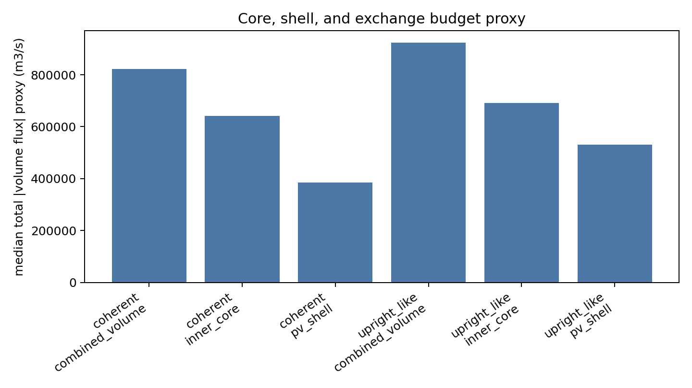

# EP-FLUX 发展脉络与 Dual-Zone EP 正式诊断口径

生成日期：2026-09-07  
性质：项目内部理论与结果脉络报告。本文只整理已有结果，不重跑 EP 数值、不修改 `src.EP` 计算逻辑。

## 0. 总结

从 EP-FLUX 开始，我们经历了五次关键升级：

1. 从传统 EP/TEM/PV flux 出发，把代表涡旋的热、PV、动量输送放进动力学诊断框架。
2. 发现普通垂向 EP flux 默认竖直坐标，不能直接处理倾斜涡旋轴，于是引入倾斜坐标修正。
3. 尝试 curved-tube EP，但 `metric_valid_fraction_median = 0`，`epsilon_curvature = kappa*r` 中位数约 `10-35`，小曲率近似失败。
4. 转向 Cartesian material volume，并逐步加入 threshold、active contour、level-set、lagrangian boundary 与 full 3D boundary budget。
5. object-level LAVD/geodesic/PV-retention 审计显示 Hua/LAVD core 与 PV anomaly core 系统性分离，PV-retention 提高通常会带来 leakage/boundary exchange 增大，因此最终升级为 Dual-Zone EP。

最终诊断口径：

\[
\mathcal{T}_{total}=\mathcal{T}_{core}^{trap}+\mathcal{T}_{shell}^{stir}+\mathcal{T}_{exchange}
\]

其中 inner material core 负责 trapping/material coherence，PV-active shell 负责 heat/PV stirring 和 EP tilt correction，exchange layer 单独列账边界 heat/PV/momentum exchange。

## 1. 问题起点

普通垂向 EP flux 写作：

\[
F_z^{ordinary}=\rho_0 f_0\frac{\langle u_n'b'\rangle}{N^2}
\]

它默认垂向坐标近似竖直。然而我们的 Kuroshiou 涡旋存在中心线倾斜、间断式层间跳变、月牙状强速带和速度中心/PV core 分离，因此普通竖直坐标并不充分。

## 2. 倾斜坐标 EP

涡旋中心线为：

\[
\mathbf r_c(z)=(x_c(z),y_c(z))
\]

沿涡旋自身坐标的垂向导数近似为：

\[
\left.\frac{D}{Dz}\right|_{eddy}\approx \partial_z-\frac{\partial x_c}{\partial z}\partial_x-\frac{\partial y_c}{\partial z}\partial_y
\]

因此：

\[
F_z^{tilted}=F_z^{ordinary}+F_z^{tilt\ correction}
\]

全生命周期验证显示：`|F_z_tilt_correction| / |F_z_ordinary|` 中位数约 `0.47`，p25-p75 约 `0.32-0.62`，最大可超过 `1`。这是目前最稳健的正结果。

## 3. Curved-Tube 尝试与失败

因为涡轴是弯曲的，我们尝试 curved-tube EP。一阶曲管 Jacobian：

\[
J=1-\kappa_\alpha x_\alpha
\]

但小曲率条件要求：

\[
\epsilon_{curvature}=\kappa r\ll 1
\]

实际结果是 `metric_valid_fraction_median = 0`，`epsilon_curvature` 中位数约 `10-35`。所以 Jacobian/Christoffel 只能作为尺度审计，不能强解释。

## 4. Material-Volume 路线

大曲率下，我们从曲管坐标转向 Cartesian material volume。边界预算写作：

\[
\oint u_n dS,\quad \oint |u_n|dS,\quad \oint \rho_0 C_p\theta'u_n dS,\quad \oint q'u_n dS,\quad \oint b'u_n dS,\quad \oint u_i'u_n dS
\]

代表涡层面的 leakage 仍不为零，约 `0.018-0.023 m/s`，说明代表涡平均场不一定是严格材料体。

## 5. Object-Level 审计

三类核心必须区分，而且它们的数学定义不同：

**Hua 弱速中心** 是运动学速度弱核，并要求 Hua/VG-like 旋转几何检验通过：

\[
\mathbf r_H(z)=\arg\min_{\mathbf r\in\Omega_z}|\mathbf u'_h(\mathbf r,z)|,
\qquad |\mathbf u'_h|=\sqrt{u'^2+v'^2}.
\]

这里的中心不是单纯速度最小点，而是“速度弱核 + 切向一致性 + 两侧反转 + 边界速度向量单调旋转”共同通过后的中心。

**LAVD 旋转相干中心** 是有限时间旋转相干核中心：

\[
\mathrm{LAVD}_{t_0}^{t_1}(\mathbf x_0)=\int_{t_0}^{t_1}|\zeta(\mathbf x(t;t_0,\mathbf x_0),t)-\overline{\zeta}(t)|dt,
\]

\[
\mathbf r_L(z)=\arg\max_{\mathbf r\in\Omega_z}\mathrm{LAVD}(\mathbf r,z).
\]

**PV anomaly core** 是动力/PV 异常核心：

\[
\mathbf r_Q(z)=\arg\max_{\mathbf r\in\Omega_z}|q'(\mathbf r,z)|,
\]

同时可用高 PV 分位区域质心审计：

\[
\mathbf r_{Q,c}(z)=\frac{\int_{\Omega_z}\mathbf r|q'|\mathbb I(|q'|>Q_p)dA}{\int_{\Omega_z}|q'|\mathbb I(|q'|>Q_p)dA}.
\]

结果显示 Hua 与 LAVD 通常较近，但 PV core 系统性偏离。因此 \(\mathbf r_H\approx\mathbf r_L\) 并不意味着 \(PV\ core\subset M_{LAVD}\)。

PV-retention hybrid 提高 PV core retention，但 leakage 和 boundary exchange 往往同步变差。例如 coherent medium sample 中，PV core retention 从约 `0.064` 提高到 `0.142`，leakage 从约 `0.0233 m/s` 增加到 `0.0288 m/s`。

## 6. Dual-Zone EP

我们不再要求：

\[
PV\ core \subset M_{LAVD}
\]

而采用：

\[
\mathcal{T}_{total}=\mathcal{T}_{core}^{trap}+\mathcal{T}_{shell}^{stir}+\mathcal{T}_{exchange}
\]

区域定义：

- `inner material core`：Hua/LAVD 近同位、低 leakage、高 retention、弱速核心连通。
- `PV-active shell`：高 `|q'|`、高 `|∇q'|`、强剪切、月牙状强速带。
- `exchange layer`：core-shell 接触带，单独列账 heat/PV/momentum boundary exchange。

## 7. 结论

当前最稳健结论：

1. 倾斜修正不是小量，倾斜坐标会显著改写热/浮力相关垂向 EP flux。
2. thin curved tube 小曲率近似在我们的代表涡上不成立。
3. 单一材料体闭合不足以解释所有输送。
4. Dual-Zone 框架更符合当前证据：inner core 负责 trapping，PV shell 负责 stirring，exchange layer 负责边界交换。

下一步：

- 使用 `python -m src.EP.cli run-dual-zone-ep-diagnostics` 作为正式诊断入口。
- 扩大 object-level medium sample，确认 PV-retention 与 leakage tradeoff 是否稳定。
- heat/PV/momentum boundary exchange 必须独立列账，不再混入 interior EP forcing。

## 参考文献

完整 BibTeX 见 `references.bib`。核心参考包括 Andrews & McIntyre 1976、Plumb 1985、Haller & Beron-Vera 2013、Haller et al. 2016、Abernathey & Haller 2018、Chelton et al. 2011、Hausmann & Czaja 2012、Dong et al. 2014，以及项目内 EP 理论 PDF。
