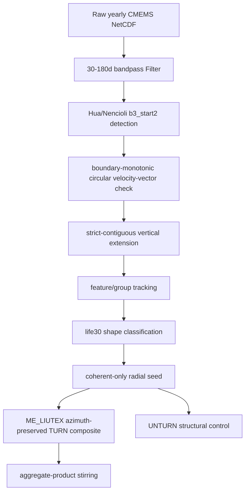

# 涓诲姛鑳介摼 Contract锛欿uroshiou Hua b3 鍒颁唬琛ㄦ丁涓庤緭閫佽瘖鏂?

鏈枃瀹氫箟褰撳墠宸ョ▼鎺ㄨ崘涓婚摼銆傚畠涓嶆槸鏂扮畻娉曡鏄庯紝鑰屾槸闃叉璇敤鏃ц剼鏈€佹棫鍙ｅ緞鍜屾棫缁撴灉鐨勫伐绋?contract銆?

## 1. 褰撳墠榛樿绉戝鍙ｅ緞

褰撳墠榛樿鍙ｅ緞鍥哄畾涓猴細

```text
Hua b3_start2
+ 30-180d bandpass
+ boundary-monotonic
+ strict-contiguous
+ life30
+ coherent-only
+ ME_LIUTEX azimuth-preserved
+ global_ls_alpha
+ aggregate-product stirring
```

浠讳綍涓嶆弧瓒充笂杩板彛寰勭殑缁撴灉锛岄兘蹇呴』鏍囦负 `legacy`銆乣diagnostic`銆乣control` 鎴?`experiment`锛屼笉鑳界О涓衡€滈粯璁や唬琛ㄦ丁鈥濄€?

## 2. 涓婚摼闃舵



## 3. 鎺ㄨ崘鍏ュ彛涓庤亴璐?

| 闃舵 | 鎺ㄨ崘鍏ュ彛 | 杈撳叆 | 杈撳嚭 | 澶囨敞 |
|---|---|---|---|---|
| 鏁版嵁涓嬭浇 | `src/data_downloading/download_kuroshiou_subset_streaming.py` | Copernicus/CMEMS | raw 骞村害 NetCDF | 鍑嵁涓庢湰鍦拌矾寰勪笉鑳芥彁浜?|
| 甯﹂€氭护娉?| `src/Legacy/Location/build_acc_bandpass_filter.py` | raw 骞村害 NetCDF | `Filter/global_phy_YYYY_bandpass_30_180d.nc` | 鍚嶇О鍚?ACC锛屼絾鐩墠涔熻 Kuroshiou 澶嶇敤 |
| Hua b3 妫€娴?| `src/Legacy/Location/run_hua_hybrid_detection_acc.py` / boundary-monotonic 瀹為獙鍏ュ彛 | Filter | per-day detection parts | 鍚庣画搴旂粺涓€涓?Kuroshiou 鍛藉悕 |
| 涓ユ牸杩炵画鎵╁睍 | `src/Legacy/Location/build_hua_strict_contiguous_detection.py` | Hua detection parts | strict detection/catalog basis | 琛ㄥ眰寮€濮嬶紝閬囬涓け璐ュ眰鍗崇粓姝?|
| catalog adapter | `src/Legacy/Location/hua_b3_catalog_adapter.py` | detection + tracking | catalog parquet | 璐熻矗杞垚 shape/浠ｈ〃娑″彲璇荤粨鏋?|
| tracking | `src/Legacy/Location/run_hua_feature_group_tracking_acc.py` | object/layer detections | feature/group tracks | 鐢熶骇搴斿亸鍚?overlap tracking |
| shape | `src/Legacy/Location/classify_3d_eddy_shape.py` | tracks + layer centers | shape tracks | life30 鏄綋鍓嶉粯璁?|
| radial seed | `src/Legacy/Location/run_representative_vortex.py` | catalog + shape | selected objects + axis + tau grid | 鍙€?coherent 榛樿 |
| ME_LIUTEX 鍚堟垚 | `src/Legacy/experiments/temp/run_azimuthal_representative_vortex.py` | radial seed + Filter | `representative_vortex_me_liutex/` | 宸叉槸浜嬪疄涓诲彛寰勶紝浣嗕粛鍦ㄥ疄楠屽尯 |
| 杈撻€佸崗鏂瑰樊 | `src/Legacy/experiments/temp/run_aggregate_product_stirring.py` | radial seed + Filter | `aggregate_product_stirring/` | product-mean 鏄富缁撹 |
| bundle 缂栨帓 | `src/Legacy/experiments/temp/run_shape_representative_bundle.py` | result root + shape | radial seed + ME_LIUTEX + stirring | 寰呮彁鍗囦负姝ｅ紡鐢熶骇鍏ュ彛 |

## 4. 鎺ㄨ崘杈撳嚭鐩綍绾﹀畾

褰撳墠 Kuroshiou 榛樿缁撴灉搴旀寜浠ヤ笅鐩綍瑙ｉ噴锛?

```text
result_boundary_monotonic/
  result_coherent_only/
    representative_vortex_radial_seed/
    representative_vortex_me_liutex/
    representative_vortex_me_liutex_unturned/
    aggregate_product_stirring/
```

鍚箟锛?

- `representative_vortex_radial_seed/`锛氬璞￠€夋嫨銆佺敓鍛藉懆鏈?tau銆侀€熷害涓績杞寸嚎銆乬lobal alpha銆?
- `representative_vortex_me_liutex/`锛歍URN 缁撴瀯鍚堟垚锛屼富缁撴瀯缁撴灉銆?
- `representative_vortex_me_liutex_unturned/`锛氫笉鏃嬭浆瀵圭収锛屽彧鐢ㄤ簬缁撴瀯鐩告秷璇勪及銆?
- `aggregate_product_stirring/`锛氱儹/PV stirring 鐨?product-mean銆乵ean-product銆乧ovariance銆?

## 5. 鐢熶骇涓婚摼缂哄彛

褰撳墠浠嶆湁涓や釜宸ョ▼缂哄彛锛?

1. `run_azimuthal_representative_vortex.py`銆乣run_aggregate_product_stirring.py`銆乣run_shape_representative_bundle.py` 浠嶅湪 `src/Legacy/experiments/temp/`锛屼絾绉戝涓婂凡鎺ヨ繎涓婚摼銆?
2. 澶氫釜鍏ュ彛浠嶅甫 `acc` 鍛藉悕锛屽嵈琚?Kuroshiou 浣跨敤锛屽悗缁簲閲嶅懡鍚嶆垨鎻愪緵鍖哄煙鏃犲叧 wrapper銆?

## 6. 涓嬩竴姝ュ缓璁?

- 灏?`run_shape_representative_bundle.py` 鎻愬崌涓烘寮忓叆鍙ｏ紝渚嬪 `src/Legacy/Location/run_shape_representative_bundle.py` 鎴栨柊鍖?`src/representative/`銆?
- 灏?Filter 鍏ュ彛鏀规垚鍖哄煙鏃犲叧鍛藉悕锛屼緥濡?`build_bandpass_filter.py`銆?
- 淇濈暀鏃у叆鍙?wrapper锛屼絾鍦?help 鏂囨鍜屾枃妗ｄ腑鏍囪 legacy銆?

## 7. 1/24° 局地亚网格中心口径

从 `result_boundary_monotonic_subgrid_1_24deg` 开始，生产中心定义更新为：

```text
原网格 Hua b3_start2 圆周判据
+ boundary-monotonic
+ strict-contiguous
+ 通过层局地 1/24° refined velocity center
```

具体含义：

- Hua 圆周切向性、两侧反转、边界速度向量单调旋转、object voxel 和 overlap tracking 仍在原 1/4°网格执行。
- 只有 `hua_pass=True` 的层会在原格点速度弱中心附近开局地窗口，对 `u'`、`v'` 做 NaN-aware 线性插值到 1/24°等效网格，再计算 `sqrt(u'^2+v'^2)` 并取加密网格速度最小点作为生产中心。
- `center_lon`、`center_lat` 是 refined 后的生产中心；旧格点中心保存在 `center_lon_grid`、`center_lat_grid`、`speed_min_i_grid`、`speed_min_j_grid`。
- catalog 中 `longitude`、`latitude` 默认继承 refined 中心；shape、代表涡和 post 图像无需额外开关即可使用新中心。
- 这不是全场 1/24°重采样，不写 1/24° Filter NetCDF；插值只发生在通过层的局地窗口中。

