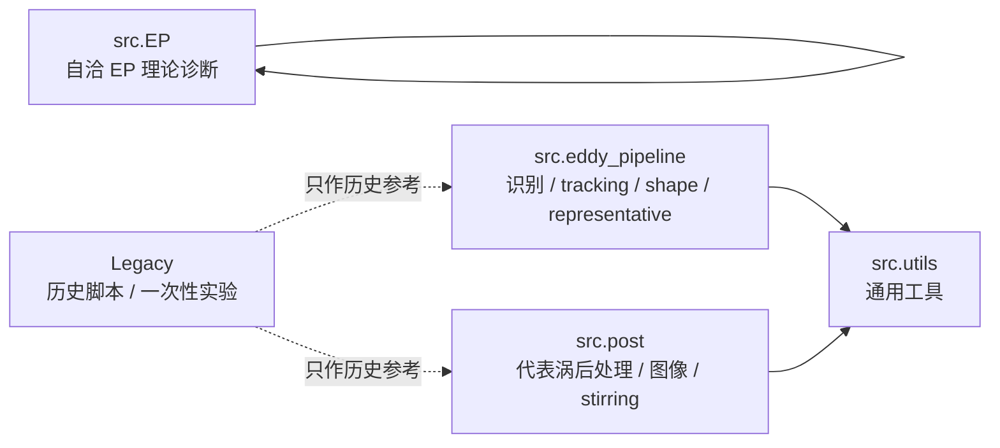
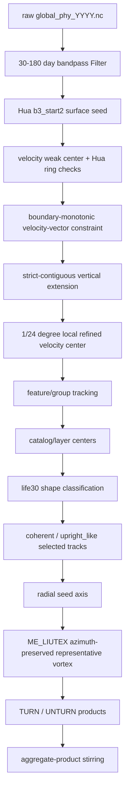

# S-H-I-T-ocean / Verify 工程接手总览

本文档用于在另一台电脑、另一个账户或新的 Codex 线程中快速接手当前工程。它不是论文正文，也不是单个实验报告，而是一份“工程地图 + 科学口径 + 风险提示 + 下一步路线”的总览。

最后更新：2026-09-07  
当前重点分支：`ZONCA-EP-FLUX-TESTZ`  
当前稳定主线分支：`Zonca`  
当前代码根目录：`G:\EDDY_detection\S-H-I-T-ocean-\Zhe`  
Git 根目录：`G:\EDDY_detection\S-H-I-T-ocean-`

> 安全说明：本文档故意不记录任何服务器口令、代码托管认证密钥或个人凭证。换机器继续时，应通过安全渠道重新配置认证。

## 1. 先读什么

如果只是要继续跑当前工程，建议按这个顺序读：

1. 本文档：先建立全局地图。
2. 根目录 `README.md`：看当前最短使用说明。
3. `Zhe/README.md`：看 Python 包边界和正式 CLI。
4. `Zhe/docs/main_pipeline_contract.md`：看识别到代表涡的生产科学契约。
5. `Zhe/docs/post_pipeline_refactor.md`：看 post 后处理边界。
6. `EP-FLUX/engineering/ep_package_refactor_notes.md`：看 EP 包自洽化和 OOP 重构状态。
7. `EP-FLUX/ep_flux_development_history_report/`：看 EP 理论一路升级的长报告。
8. `EP-FLUX/core_shell_partition_v2/`：看 core-shell / dual-zone 分区判据和图表。

最重要的原则是：先确认“口径”，再跑代码。这个工程里有多套历史结果、多种代表涡、多种中心定义，如果不先锁定口径，非常容易把旧结果、诊断图和正式主链混在一起。

## 2. 当前工程一句话概括

这个工程目前围绕 Kuroshiou 中尺度涡旋的三维识别、tracking、形态分类、代表涡合成、输送诊断和 EP-flux 理论验证展开。当前生产识别口径已经升级为：

```text
Hua b3_start2
+ 30-180 day bandpass velocity
+ boundary_monotonic velocity-vector constraint
+ strict_contiguous vertical extension
+ 1/24 degree local refined velocity center
+ life30 shape filtering
+ coherent_only / upright_like shape products
+ ME_LIUTEX azimuth-preserved representative vortex
+ global_ls_alpha alignment
```

当前 EP 理论解释口径已经从“单一材料涡体积闭合”升级为：

```text
inner material core + PV-active shell + exchange layer
```

也就是：

```text
T_total = T_core^trap + T_shell^stir + T_exchange
```

其中 inner core 主要解释 trapping / material coherence，PV-active shell 主要解释 heat/PV stirring 与 EP 倾斜修正，exchange layer 用来单独列账 heat/PV/momentum boundary exchange。

## 3. 目录结构与包边界

仓库根目录目前很简单：

```text
G:\EDDY_detection\S-H-I-T-ocean-\
  README.md
  PROJECT_HANDOFF_ZH.md
  Zhe\
  EP-FLUX\
```

真正 Python 代码在 `Zhe/` 下。这个“代码多包一层”的历史状态已经被接受为当前结构，不要在没有专项迁移计划时把 `Zhe/src` 直接搬到仓库根目录。

### 3.1 `Zhe/src/eddy_pipeline`

这是识别、tracking、catalog、shape classification 和代表涡结构合成的生产主链。正式入口包括：

```powershell
cd G:\EDDY_detection\S-H-I-T-ocean-\Zhe
python -m src.eddy_pipeline.cli --help
python -m src.eddy_pipeline.bundle --help
```

主要职责：

- Hua / Nencioli `b3_start2` 风格识别。
- boundary-monotonic 边界速度向量约束。
- strict-contiguous 垂向扩展。
- 1/24° local refined velocity center。
- feature/group tracking。
- life30 shape classification。
- coherent-only / upright_like 代表涡合成 bundle。

`eddy_pipeline` 可以使用 `src.utils` 中被提升出来的通用工具，但不应该回头依赖 `src.Legacy`。

### 3.2 `Zhe/src/post`

这是代表涡之后的正式后处理包。正式入口：

```powershell
python -m src.post.cli --help
```

主要职责：

- aggregate-product stirring。
- 代表涡结构图。
- TURN / UNTURN 对照图。
- double-core 结构诊断。
- 原始涡旋 panel family。
- jump-parallel / jump-normal / axis-curved 剖面图。
- jump 与垂直速度剪切、圆度、多弱核关系诊断。

`post` 的定位是“结果解释和标准图表”，不是识别主链，也不是 EP 理论包。

### 3.3 `Zhe/src/EP`

这是 EP 理论诊断包，当前正在向完全自洽、面向对象的方向重构。正式入口只能走：

```powershell
python -m src.EP.cli --help
```

`src.EP` 的重要约束：

- 不从 `src.post.transport` 取 aggregate-product 逻辑。
- 不从 `src.post.representative_eddy_panels` 取 axis 或绘图逻辑。
- 不从历史 `src.utils.axis_streamfunction`、`src.utils.field_sampling` 取正式计算依赖。
- EP 内部已有 `io.py`、`numerics.py`、`axis_sources.py`、`transport_moments.py`，用于自洽读写、数值计算、axis source 和 object-day moments。

EP 的正式解释入口正在收敛到：

```powershell
python -m src.EP.cli run-dual-zone-ep-diagnostics --dry-run
```

### 3.4 `Zhe/src/utils`

这是 `eddy_pipeline` 和 `post` 可共享的通用工具层。它的角色是防止识别和后处理重复造轮子，例如表格读写、速度场基础计算、采样和通用数值函数。

注意：EP 理论包目前要求更严格的自洽性，所以 EP 正式计算不应再反向依赖这里。

### 3.5 `Zhe/src/data_downloading`

数据下载和数据获取相关工具。此前重构时明确“先忽略 data downloading”，所以它不属于当前识别到 EP 理论主链的重构重点。

### 3.6 `Zhe/src/Legacy` 与 `Zhe/legacy`

历史脚本、一次性实验、早期口径、论文复刻和不再作为默认入口的旧代码应放在 legacy。它们可以作为可追溯资料，但不能和 `eddy_pipeline`、`post`、`EP` 具有同等生产地位。

### 3.7 `EP-FLUX`

这是 EP 理论文档、验证结果、图表、PDF 和工程说明目录。它不是 Python 包。当前重要子目录包括：

- `EP-FLUX/engineering/`：EP 包重构说明。
- `EP-FLUX/core_shell_partition_v2/`：core-shell V2 分区判据、图表和报告。
- `EP-FLUX/ep_flux_development_history_report/`：EP-FLUX 发展脉络长报告。
- `EP-FLUX/archive/`：旧 smoke 和临时验证归档。

## 4. 包依赖方向

正式依赖方向应保持单向：



关键规矩：

- `eddy_pipeline` 是识别到代表涡合成主链。
- `post` 是代表涡之后的图像和输送后处理。
- `EP` 是理论诊断，不从 `post` 或历史 utils 借核心实现。
- `Legacy` 不能成为新代码默认 import 目标。

## 5. 数据、服务器与结果目录

### 5.1 本地与服务器代码位置

本地 source of truth：

```text
G:\EDDY_detection\S-H-I-T-ocean-\Zhe
```

服务器干净代码目录约定：

```text
/root/Verify/Zhe
```

此前已经明确：不要再把服务器旧的 `/root/Verify` 脏目录当作可信代码来源。服务器只是运行环境，本地仓库和 GitHub 分支才是代码管理来源。同步到服务器时应排除：

```text
.git/
.venv/
outputs/
__pycache__/
大体积结果目录
```

服务器运行时推荐固定：

```bash
cd /root/Verify/Zhe
source /root/miniconda3/etc/profile.d/conda.sh
conda activate eddy_verify
python -m src....
```

### 5.2 Kuroshiou 数据根目录

服务器数据和结果主要位于：

```text
/root/autodl-fs/kuroshiou
```

关键子目录：

```text
/root/autodl-fs/kuroshiou/raw
/root/autodl-fs/kuroshiou/Filter
/root/autodl-fs/kuroshiou/result_boundary_monotonic_subgrid_1_24deg
/root/autodl-fs/kuroshiou/EP-FLUX
/root/autodl-fs/kuroshiou/logs
```

重要安全边界：

- 不删除 `raw/`。
- 不删除 `Filter/`。
- 不覆盖当前最新 `result_boundary_monotonic_subgrid_1_24deg/`。
- 旧 `result_boundary_monotonic/` 只可作为历史对照，不再作为最新结论主口径。
- 本地下载轻量图表一般放在 `G:\TEMP\...`，不要把大体积 parquet/npz/cache 随手塞进 Git。

### 5.3 最新识别结果目录

当前最新全量识别结果是：

```text
/root/autodl-fs/kuroshiou/result_boundary_monotonic_subgrid_1_24deg
```

它与旧结果的核心区别是加入了：

```text
1/24 degree local refined velocity center
```

这一步不是全场重采样，而是在 Hua 原网格检测通过之后，对局地速度弱核做亚网格精修。它的目的不是改变 Hua 判据本身，而是缓解原 1/4° 网格中心造成的“竖直钉格点”和突跳假象。

保留审计字段的原则是：

- 生产中心：`center_lon / center_lat` 使用 refined center。
- 审计中心：保留原始 grid center。
- refined 失败时回退原格点中心，并记录失败标记。

### 5.4 最新代表涡结果

最新 coherent-only 代表涡目录：

```text
/root/autodl-fs/kuroshiou/result_boundary_monotonic_subgrid_1_24deg/result_coherent_only
```

最新 upright_like 代表涡目录：

```text
/root/autodl-fs/kuroshiou/result_boundary_monotonic_subgrid_1_24deg/result_upright_like
```

每个 shape 结果下应保持分目录：

```text
representative_vortex_radial_seed/
representative_vortex_me_liutex/
representative_vortex_me_liutex_unturned/
aggregate_product_stirring/
```

语义分别是：

- `representative_vortex_radial_seed/`：对象中心线、生命周期样本、axis diagnostics。
- `representative_vortex_me_liutex/`：global-alpha TURN 后的 ME_LIUTEX azimuth-preserved 代表涡结构。
- `representative_vortex_me_liutex_unturned/`：不转向的结构对照。
- `aggregate_product_stirring/`：热/PV 协方差输送诊断，不能和结构合成混放。

## 6. 识别到代表涡的生产流程

生产流程可以概括为：



正式命令示例：

```bash
cd /root/Verify/Zhe
source /root/miniconda3/etc/profile.d/conda.sh
conda activate eddy_verify

python -m src.eddy_pipeline.cli run-detection-to-shape \
  --output-root /root/autodl-fs/kuroshiou/result_boundary_monotonic_subgrid_1_24deg \
  --start 1993-01-01 --end 2022-12-31 \
  --lifetime-min-days 30 \
  --radius-min-m 50000 \
  --min-valid-layers 6 \
  --detect-parallel 1
```

注意：不要显式关闭 subgrid refinement，除非是在做旧口径对照。默认应保留 1/24° local refined center。

代表涡 bundle 示例：

```bash
python -m src.eddy_pipeline.bundle \
  --config /root/Verify/Zhe/config/config_kuroshio_results_cpu.yaml \
  --results-root /root/autodl-fs/kuroshiou/result_boundary_monotonic_subgrid_1_24deg \
  --filter-root /root/autodl-fs/kuroshiou/Filter \
  --output-root /root/autodl-fs/kuroshiou/result_boundary_monotonic_subgrid_1_24deg \
  --shapes coherent \
  --polarities cyclonic,anticyclonic \
  --orientation both \
  --field-cache-mode day \
  --radial-workers 1 \
  --stirring-workers 1 \
  --chunk-days 7 \
  --max-depth-m 2000 \
  --tau-grid-step 0.05 \
  --kernel-bandwidth 0.075 \
  --radial-bins 40 \
  --azimuth-bins 72 \
  --rmax 2.5 \
  --resume
```

如果要做 `upright_like`，应显式设置：

```text
--shape-output-name result_upright_like
--shapes upright_like
```

## 7. 中心、轴线与代表涡定义

当前工程里至少存在几类“中心/核心”，必须分开理解。

### 7.1 Hua 弱速中心

Hua 中心是识别主链的生产中心。它不是压强极值，也不是 PV 极值，而是速度场中的弱速核，并且需要满足 Hua/VG-like 的旋转几何检查、两侧反转、圆周切向性和 boundary-monotonic 等条件。

在 1/24° 新口径中，Hua 判据仍在原始 1/4° 数据网格上完成，通过后再在局地窗口精修速度弱核中心。

物理意义：

- 更接近运动学速度弱核。
- 适合描述我们当前检测算法看到的 eddy center。
- 会受速度场非圆、多弱核、月牙状强速带影响。

### 7.2 radial_seed axis

`radial_seed_axis` 是代表涡合成时由原始 object-day 中心线聚合得到的轴线。它是当前代表涡默认 axis source。

物理意义：

- 表示“原始对象中心线合成后的代表轴”。
- 与识别 catalog 一致。
- 默认最适合和原始检测、tracking、shape 口径保持一致。

### 7.3 composite_hua_refined_axis

`composite_hua_refined_axis` 是在合成后的代表涡速度场上重新做 Hua-like/refined 中心识别得到的轴线。

它已经被设计成代表涡的可选属性之一，但默认不替代 `radial_seed_axis`。未声明时仍应使用 `radial_seed_axis`。

物理意义：

- 表示“平均后的速度场自己重新识别出的弱速核”。
- 用于审计“先合成后识别”和“先识别后合成”是否可交换。
- 如果它与 radial seed axis 差异很大，说明合成平均改变了弱核几何，不能简单把代表场上的中心等同于原始对象平均中心。

### 7.4 LAVD 旋转相干中心

LAVD 中心来自有限时间旋转相干性，典型形式是沿粒子轨迹积分相对涡度偏差：

```text
LAVD(x0) = integral | zeta(x(t; x0), t) - mean_zeta(t) | dt
```

物理意义：

- 表示旋转相干材料核附近的中心。
- 更偏 Lagrangian material coherence。
- 当前小样本诊断显示 Hua 与 LAVD 中心通常较接近。

### 7.5 PV anomaly core

PV anomaly core 是动力/PV 异常核心，通常由高 `|q'|`、高 `|grad q'|` 或 PV proxy 质心/极值定义。

物理意义：

- 更接近动力核心和 PV 活跃区。
- 当前诊断显示它可能系统性偏离 Hua/LAVD 运动学核心。
- 这正是后续 Dual-Zone 理论的重要动机。

## 8. Post Panel Family

原始涡旋和代表涡都有 panel family 图。它最早是 7-panel，后来扩展成“9-panel family”，现在实际可以超过 9 个 panel。

正式入口：

```powershell
python -m src.post.cli plot-original-eddy-panels --help
python -m src.post.cli plot-representative-eddy-panels --help
```

核心 panel 语义：

- 1/2：`delta x(z)` 与 `delta y(z)`，相对表层中心，横轴同尺度。
- 3/4/5/6：第一、第二跳变点 upper/lower 层的水平速度场与压强代理场。
- 8/9/10/11：剖面诊断变量，可以是 Omega-w、法向水平速度、水平速度模、signed horizontal speed 等。
- 7：原始涡旋为生命周期轨迹，代表涡为 composite support 或生命周期支撑图。

### 8.1 jump-parallel

`jump-parallel` 剖面沿中心跳变方向：

```text
e_parallel = (Delta x, Delta y) / |Delta r|
```

它回答：沿两个中心之间的跳变路径，速度、零线或剪切结构是否发生变化。

### 8.2 jump-normal

`jump-normal` 剖面沿：

```text
e_normal = (-Delta y, Delta x) / |Delta r|
```

并穿过上下层中心中点。它回答：是否存在一条横切中心跳变路径的剪切/零线边界。

### 8.3 axis-curved

`axis-curved` 是沿整个三维中心轴随动的曲面剖面。经过修正后，它不再把每一层中心都平移到横轴 0，而是保留相对表层中心的投影位移。

它回答：固定平面投影是否制造了“零线连续但中心跳”的错觉。如果 axis-curved 中仍显示弱核/零线不连续，则更支持多弱核、非圆结构或月牙强速带导致中心候选切换。

### 8.4 右侧诊断变量

常用右侧变量：

- `normal_horizontal_velocity`：`u_perp = u_h dot e_perp`，看方向性符号反转。
- `horizontal_speed`：`|u_h|`，看速度弱核、强速带和低速槽。
- `signed_horizontal_speed`：`sign(u_perp) * |u_h|`，颜色正负来自 `u_perp`，大小来自水平速度模。
- `omega_w`：Omega 方程诊断得到的垂直速度或其垂向梯度，属于物理代理诊断。

解释时要注意：`u_perp=0` 只是某个剖面中的投影零线，不等同于 Hua 中心。Hua 中心是二维速度弱核加旋转几何条件的结果，所以零线连续而中心跳变并不矛盾。

## 9. Aggregate-Product Stirring

输送诊断不能用“平均结构相乘”替代。当前正式口径是 aggregate-product：

```text
product_mean = mean(v_rot * X)
mean_product = mean(v_rot) * mean(X)
covariance = product_mean - mean_product
```

其中：

- 热输送时 `X = theta'`。
- PV 输送时 `X = q'` 或 QG-like PV proxy。

物理意义：

- `product_mean` 是乘积后平均，更接近真实扰动输送。
- `mean_product` 是平均后乘积，只是对照。
- `covariance` 是结构共变导致的输送贡献，是目前解释 heat/PV stirring 的重点。

因此，代表涡速度场的漂亮结构图不能直接替代 `mean(v theta)` 或 `mean(v q)`。结构合成和输送诊断必须分目录保存。

## 10. EP-FLUX 理论工程的演进

EP-FLUX 这部分不是一开始就有当前 Dual-Zone 结论，而是经历了几次理论升级。理解这个过程很重要，因为每一次升级都是为了解决上一版暴露的问题。

### 10.1 ordinary vertical EP flux

最初的想法是把代表涡旋的热、浮力、PV 和动量输送放入传统 EP/TEM/PV flux 框架。普通垂向 EP flux 可以写成近似形式：

```text
F_z_ordinary = rho0 * f0 * <u_n' b'> / N^2
```

这里默认垂向坐标就是普通竖直方向，适合近似直立结构。但我们的涡旋中心线往往随深度倾斜，所以普通垂向导数和沿涡轴坐标的垂向导数并不一致。

### 10.2 tilted-coordinate EP correction

为处理倾斜中心轴，引入倾斜坐标修正：

```text
F_z_tilted = F_z_ordinary + F_z_tilt_correction
```

这个修正来自：当中心轴 `r_c(z)` 随深度移动时，沿涡旋自身坐标看的垂向变化包含水平梯度投影项。直观地说，倾斜涡旋中“往下看一层”并不是在同一个水平位置看一层，而是在沿着中心轴偏移后看一层。

当前最稳健的正结果就是：

```text
|F_z_tilt_correction| / |F_z_ordinary| 的中位数约 0.47
p25-p75 约 0.32-0.62
最大值可超过 1
```

这说明倾斜修正不是小量。换句话说，如果使用倾斜涡旋坐标，热/浮力相关的垂向 EP flux 会被明显改写。

### 10.3 curved-tube metric/Jacobian/Christoffel

下一步自然想到：如果涡轴不只是倾斜，而是弯曲，那么应当用曲管坐标。于是尝试了 metric、Jacobian 和 Christoffel 项。曲管的一阶 Jacobian 可写成：

```text
J = 1 - kappa_alpha * x_alpha
```

但审计结果显示，当前代表涡旋不满足 thin curved tube 的小曲率要求：

```text
metric_valid_fraction_median = 0
epsilon_curvature = kappa * r 的中位数量级约 10-35
```

这远大于小曲率近似要求。结论是：曲管几何项提示我们“几何很重要”，但当前一阶 thin-tube 近似不能强解释 Jacobian/Christoffel 的物理闭合。

### 10.4 material-volume 路线

由于 thin curved tube 在大曲率下失败，路线转向 Cartesian material volume。逻辑是：不要强行把大曲率涡旋塞进小曲率坐标，而是在笛卡尔体积里直接做边界和通量预算。

这个阶段尝试过：

- threshold mask。
- active-contour-like low leakage boundary。
- levelset_v2。
- lagrangian_v1 时间连续边界。
- full 3D boundary flux budget。
- particle retention / LAVD / geodesic material boundary。
- PV-retention-aware boundary。

这个阶段的重要发现是：降低 leakage 并不自动意味着围住 PV anomaly core。LAVD/geodesic 边界更容易圈住旋转相干核，但 PV retention 可能偏低；如果强行提高 PV retention，leakage 和 boundary exchange 往往变差。

### 10.5 三类核心分离

当前诊断中至少有三类核心：

```text
Hua weak-speed center
LAVD rotationally coherent center
PV anomaly core
```

已知趋势是：

- Hua 与 LAVD 通常较接近。
- PV core 可能系统性偏离 Hua/LAVD core。
- 因此 EP 闭合失败未必说明 EP 公式本身错，也可能说明“材料旋转核心”和“PV 动力核心”本来就不是同一个区域。

这一步是 dual-zone 理论的直接来源。

### 10.6 Dual-Zone EP

最终我们不再强行要求：

```text
PV core subset of LAVD material core
```

而采用：

```text
T_total = T_core^trap + T_shell^stir + T_exchange
```

解释为：

- `inner material core`：Hua/LAVD 近同位、低 leakage、高 retention，负责 trapping/material coherence。
- `PV-active shell`：高 `|q'|`、高 `|grad q'|`、强剪切、月牙状强速带，负责 heat/PV stirring 和 EP tilt correction 的主要活跃区。
- `exchange layer`：core 和 shell 的接触带，单独列账 heat/PV/momentum boundary exchange。

这不是退而求其次，而是更符合当前数据事实：稳定旋转核和动力输送活跃区并不一定同位。

## 11. EP 包当前代码结构

`Zhe/src/EP` 当前已经从单文件实验逐步拆成 OOP/模块化结构。重要模块如下：

```text
contracts.py              默认口径、路径、枚举和配置契约
io.py                     EP 内部读写，读取代表涡、axis、N2、Filter day
numerics.py               vorticity、streamfunction、采样、导数、网格工具
axis_sources.py           radial_seed / composite_hua_refined axis source
transport_moments.py      EP 内部 aggregate-product object-day moments
geometry.py               轴线、局地坐标、Bishop frame 等
metric.py                 curved-tube metric/Jacobian/Christoffel audit
flux.py                   classic / tilted / curved EP 基础计算
lifecycle.py              全生命周期 EP 调度
track_accumulator.py      track-level bootstrap / jackknife accumulator
statistics.py             CI、jackknife、summary
partition.py              inner core / PV shell / exchange mask
region_flux.py            分区 heat/PV/momentum aggregate-product
region_ep.py              分区 EP tilt correction
core_shell_runner.py      core-shell / dual-zone runner
boundary_strategy.py      BoundaryStrategy 接口和边界策略
material_volume.py        代表涡 material-volume 验证
material_coherence.py     particle retention / LAVD coherence 验证
material_geodesic.py      Cauchy-Green / LAVD / hybrid geodesic 验证
dynamic_boundary.py       low leakage / level-set boundary 验证
object_material_boundary.py object-level boundary budget
dual_zone.py              正式 Dual-Zone EP 诊断入口逻辑
cli.py                    EP 唯一正式命令入口
```

当前还在推进的重构方向：

- 继续把 `core_shell_runner.py` 中的大函数拆到 `partition.py`、`region_flux.py`、`region_ep.py`。
- 继续统一 `material_volume.py`、`material_geodesic.py`、`material_coherence.py` 到 `BoundaryStrategy` 接口。
- 为 output schema、region masks、axis source 添加更强测试。

正式 EP 命令不要绕过 `src.EP.cli`。

## 12. 常用命令与接手机器检查

### 12.1 本地检查

在新电脑上 clone 或同步后，先检查分支和入口：

```powershell
cd G:\EDDY_detection\S-H-I-T-ocean-
git status --short --branch
git branch --show-current

cd G:\EDDY_detection\S-H-I-T-ocean-\Zhe
python -m src.eddy_pipeline.cli --help
python -m src.post.cli --help
python -m src.EP.cli --help
```

如果只想确认 EP 正式入口：

```powershell
python -m src.EP.cli explain-contract
python -m src.EP.cli run-dual-zone-ep-diagnostics --dry-run
```

如果要确认识别主链默认仍然是 1/24° refined center：

```powershell
python -m src.eddy_pipeline.cli --dry-run
```

注意看输出中是否包含：

```text
boundary_monotonic
strict_contiguous
local_1_24deg_refined_velocity_center
```

### 12.2 服务器 smoke 习惯

服务器运行前先做：

```bash
cd /root/Verify/Zhe
source /root/miniconda3/etc/profile.d/conda.sh
conda activate eddy_verify

python -m py_compile src/eddy_pipeline/*.py src/post/*.py src/EP/*.py
python -m src.eddy_pipeline.cli --help
python -m src.post.cli --help
python -m src.EP.cli --help
```

长任务必须后台运行并写日志，例如：

```bash
mkdir -p /root/autodl-fs/kuroshiou/logs
nohup python -m src.EP.cli run-dual-zone-ep-diagnostics \
  --output-root /root/autodl-fs/kuroshiou/EP-FLUX/dual_zone_ep_diagnostics \
  > /root/autodl-fs/kuroshiou/logs/dual_zone_ep_diagnostics.log 2>&1 &
echo $! > /root/autodl-fs/kuroshiou/logs/dual_zone_ep_diagnostics.pid
```

之后只读检查：

```bash
cat /root/autodl-fs/kuroshiou/logs/dual_zone_ep_diagnostics.pid
tail -n 80 /root/autodl-fs/kuroshiou/logs/dual_zone_ep_diagnostics.log
du -sh /root/autodl-fs/kuroshiou/EP-FLUX/dual_zone_ep_diagnostics
```

### 12.3 下载规则

默认只下载轻量结果：

```text
*.csv
*.json
*.md
*.tex
*.pdf
figures/*.png
logs/*.log
```

默认不下载：

```text
large parquet caches
npz representative arrays
particle trajectory caches
temporary accumulator files
```

本地临时查看图像建议放在：

```text
G:\TEMP\...
```

正式理论文档和报告放在：

```text
G:\EDDY_detection\S-H-I-T-ocean-\EP-FLUX\...
```

## 13. 当前重要结论

### 13.1 1/24° refined center 的意义

旧 1/4° 中心容易产生两类视觉假象：

- 多层中心钉在同一个格点，看起来像完全竖直。
- 相邻层真实偏移不到一个格点时，被显示成突然跳格。

1/24° local refinement 的作用是缓解这种格点锁定。它不会重新定义 Hua 判据，只是在通过层的局地速度弱核上做精修。因此新旧结果必须并列比较，不能把旧图和新图混成同一批结论。

### 13.2 coherent 与 upright_like

当前主结论仍以 coherent-only 为主。upright_like 是重要对照，用来判断更直立形态是否具有：

- 更弱倾斜修正。
- 更稳定或更窄的 material core。
- 更弱或不同分布的 PV-active shell。
- 不同的 heat/PV/momentum boundary exchange。

如果比较 coherent 和 upright_like，要确认它们都来自最新：

```text
result_boundary_monotonic_subgrid_1_24deg
```

而不是旧 `result_boundary_monotonic`。

### 13.3 TURN 与 UNTURN

TURN 是主物理口径：

```text
global_ls_alpha / global-alpha alignment
```

UNTURN 是结构对照，用来确认转向合成是否增强角结构、月牙强速带和 EP 信号。不要把 UNTURN 当作主输送结论。

### 13.4 倾斜 EP 修正

当前最稳健的 EP 正结果是：

```text
|F_z_tilt_correction| / |F_z_ordinary| median ≈ 0.47
p25-p75 ≈ 0.32-0.62
```

物理含义是：倾斜涡旋坐标会明显改写热/浮力相关的垂向 EP flux。这个结论比 curved-tube Jacobian/Christoffel 更可靠，因为它不依赖小曲率假设成立。

### 13.5 curved-tube 失败

thin curved tube 的小曲率近似在当前代表涡上不成立：

```text
metric_valid_fraction_median = 0
epsilon_curvature = kappa * r median ≈ 10-35
```

因此不能强行解释 Jacobian/Christoffel 项，只能把它们当作尺度审计和失败证据。后续理论不能建立在“一阶曲管闭合已经成立”上。

### 13.6 单一材料体闭合不足

material-volume、LAVD/geodesic、PV-retention 边界优化的共同教训是：

- 低 leakage 边界更像旋转相干 material core。
- PV anomaly core 往往不完全在这个低 leakage core 内。
- 提高 PV retention 往往会增加 leakage 或 boundary exchange。

这说明闭合失败可能不是 EP 公式本身错误，而是试图用一个单一材料体同时解释 trapping、PV stirring 和边界交换，本身就过于强。

### 13.7 Dual-Zone 是当前正式解释框架

当前更合理的理论框架是：

```text
inner material core: trapping / material coherence
PV-active shell: heat/PV stirring + EP tilt correction
exchange layer: heat/PV/momentum boundary exchange
```

所以后续报告应写：

```text
T_total = T_core^trap + T_shell^stir + T_exchange
```

而不是继续强行要求：

```text
PV core subset of LAVD material core
```

## 14. 易错点清单

### 14.1 不要混用旧结果

旧目录可能仍存在或曾经存在：

```text
result_boundary_monotonic
result_strict_contiguous
result_coherent_only
```

当前新主结果是：

```text
result_boundary_monotonic_subgrid_1_24deg
```

写报告、画图、跑代表涡时必须明确来源。

### 14.2 不要把代表涡当 object-level 强结论

代表涡是合成平均结构，本身不严格满足材料守恒。材料边界、LAVD、geodesic、PV-retention 的强判断优先级应来自 object-level track/object-day，而不是代表涡平均场。

### 14.3 不要把 `u_perp=0` 当 Hua 中心

`u_perp=0` 是剖面投影零线。Hua 中心是二维速度弱核 + 旋转几何条件 + boundary-monotonic 的识别结果。二者接近时可以作为证据，不接近时也不必然说明代码错误。

### 14.4 不要混淆 pressure center 与 velocity center

压强/流函数极值中心、速度弱核中心、LAVD 中心、PV core 都可能不同。当前工程的生产中心默认是 Hua refined velocity center。

### 14.5 不要把平均后乘积当输送

平均结构图和 `mean(v) * mean(theta)` 都不能替代真实扰动输送。输送主结论应看 `mean(v * theta)`、`mean(v * q)` 和 covariance。

### 14.6 不要让 EP 包重新依赖 post

EP 已经被要求自洽。正式 EP 代码如果又开始 import `src.post` 或历史 `src.utils`，会重新造成包边界混乱。

## 15. 分支策略

当前分支角色：

```text
Zonca
  日常稳定主线。识别、post、代表涡主链已经多次合并到这里。

A1-CHAO
  另一个需要同步稳定成果的分支。不是所有 EP 实验都立即合入。

ZONCA-EP-FLUX-TESTZ
  当前 EP 理论诊断、material boundary、dual-zone 研究分支。
  新 EP 结果稳定前，不自动合并到 Zonca / A1-CHAO。
```

当前这份 handoff 文档应提交在：

```text
ZONCA-EP-FLUX-TESTZ
```

如果将来要把 EP 正式口径推广到主线，应先确认：

- `run-dual-zone-ep-diagnostics` smoke 与目标输出稳定。
- `src.EP` 无正式反向依赖 `src.post` 或旧 `src.utils`。
- PDF/Markdown 报告已经把 representative、object-level medium sample、full lifecycle 结论区分清楚。
- 不包含任何本地临时大文件、账号凭证或服务器密码。

## 16. 当前未完成工作

### 16.1 EP 包工程化

已完成方向：

- 新建了 `src.EP` OOP 理论诊断包。
- 加入 EP 内部 `io/numerics/axis_sources/transport_moments`。
- 拆出了 `partition/region_flux/region_ep/core_shell_runner`。
- 建立了 `BoundaryStrategy` 方向。

仍需继续：

- 把剩余大函数从 runner 中进一步拆出来。
- 给 `BoundaryStrategy` 增加统一输入输出 schema。
- 给 material boundary、PV retention、LAVD/geodesic 增加 synthetic tests。
- 明确哪些 experimental mode 可以升级为正式 mode。

### 16.2 Dual-Zone 诊断

当前理论已经转向 Dual-Zone，但仍需要继续补强：

- object-level medium sample 扩大到更多 tracks。
- 系统确认 PV retention 增强时 leakage / boundary exchange 是否稳定变差。
- heat/PV/momentum boundary exchange 继续单独列账。
- coherent 与 upright_like 的差异需要在更多 track 上确认。

### 16.3 代表涡与 panel family

已完成：

- 原始涡旋 panel family。
- jump-parallel / jump-normal / axis-curved。
- signed horizontal speed。
- composite_hua_refined_axis 可作为代表涡 axis source。

仍需注意：

- `axis_curved` 必须保留倾斜投影，不能把每层中心强制平移到 0。
- 紫色或额外辅助线若用户已明确不要，不应再加回。
- 对 40 个原始涡旋和代表涡的图像版本要在文件名中写清变量和 section mode。

### 16.4 结果管理

仍需定期整理：

- `G:\TEMP` 中旧图和旧下载。
- `EP-FLUX/archive` 中旧 smoke。
- 服务器 `/root/autodl-fs/kuroshiou` 中废弃 smoke 或旧口径结果。

删除服务器结果前必须确认不是当前最新主链、不是 raw、不是 Filter。

## 17. 推荐下一步

如果下一个人要继续工程，推荐从以下四件事开始：

1. 在新机器上 clone / 同步仓库，确认 `ZONCA-EP-FLUX-TESTZ` 分支可用。
2. 跑三个 help：

```powershell
cd G:\EDDY_detection\S-H-I-T-ocean-\Zhe
python -m src.eddy_pipeline.cli --help
python -m src.post.cli --help
python -m src.EP.cli --help
```

3. 跑 EP contract dry-run：

```powershell
python -m src.EP.cli run-dual-zone-ep-diagnostics --dry-run
```

4. 先读 `EP-FLUX/core_shell_partition_v2/` 和 `EP-FLUX/ep_flux_development_history_report/`，再决定是否继续 object-level medium sample。

如果目标是写论文或报告，优先使用这些结论：

- 倾斜修正不是小量。
- thin curved tube 小曲率闭合不成立。
- Hua/LAVD 运动学 core 与 PV anomaly 动力 core 分离。
- Dual-Zone 比 single material eddy volume 更适合解释当前 heat/PV/momentum exchange。

如果目标是改代码，优先处理：

- `src.EP` 自洽化。
- `BoundaryStrategy` 接口统一。
- output schema 测试。
- `run-dual-zone-ep-diagnostics` 的稳定 CLI 契约。

## 18. 最小验收清单

接手后，如果下面几项都成立，说明工程基本处于可继续状态：

```text
git status --short --branch
  当前分支清楚，没有意外大文件待提交。

python -m src.eddy_pipeline.cli --help
  能看到 subgrid center refinement 相关参数。

python -m src.post.cli --help
  能看到 panel family、jump relation、transport、double-core 入口。

python -m src.EP.cli --help
  能看到 lifecycle、material、geodesic、core-shell、dual-zone 入口。

rg "from src\.post|import src\.post|from src\.utils|import src\.utils" Zhe/src/EP --glob "*.py"
  正式 EP 代码不应出现反向依赖。
```

## 19. 一句话给未来接手者

这个工程现在最重要的不是“再多跑一个图”，而是每次跑之前确认你站在哪个科学口径上：旧 1/4° 还是新 1/24°，coherent 还是 upright_like，TURN 还是 UNTURN，radial seed 还是 composite-Hua，代表涡还是 object-level，single material body 还是 dual-zone。只要这些先讲清楚，后面的代码和结果就不会互相打架。
