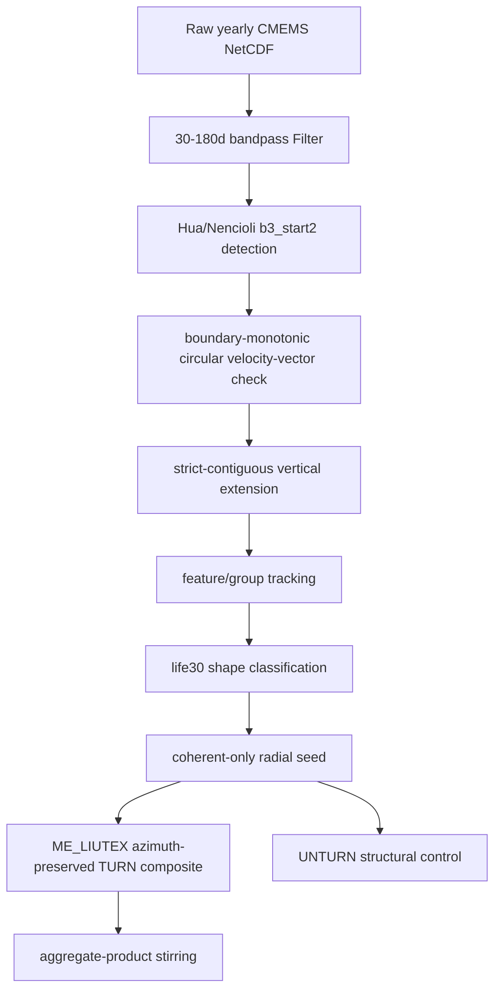

# 主功能链 Contract：Kuroshiou Hua b3 到代表涡与输送诊断

本文定义当前工程推荐主链。它不是新算法说明，而是防止误用旧脚本、旧口径和旧结果的工程 contract。

## 1. 当前默认科学口径

当前默认口径固定为：

```text
Hua b3_start2
+ 30-180d bandpass
+ boundary-monotonic
+ strict-contiguous
+ life30
+ coherent-only
+ ME_LIUTEX azimuth-preserved
+ global_ls_alpha
+ aggregate-product stirring
```

任何不满足上述口径的结果，都必须标为 `legacy`、`diagnostic`、`control` 或 `experiment`，不能称为“默认代表涡”。

## 2. 主链阶段



## 3. 推荐入口与职责

| 阶段 | 推荐入口 | 输入 | 输出 | 备注 |
|---|---|---|---|---|
| 数据下载 | `src/data_downloading/download_kuroshiou_subset_streaming.py` | Copernicus/CMEMS | raw 年度 NetCDF | 凭据与本地路径不能提交 |
| 带通滤波 | `src/Location/build_acc_bandpass_filter.py` | raw 年度 NetCDF | `Filter/global_phy_YYYY_bandpass_30_180d.nc` | 名称含 ACC，但目前也被 Kuroshiou 复用 |
| Hua b3 检测 | `src/Location/run_hua_hybrid_detection_acc.py` / boundary-monotonic 实验入口 | Filter | per-day detection parts | 后续应统一为 Kuroshiou 命名 |
| 严格连续扩展 | `src/Location/build_hua_strict_contiguous_detection.py` | Hua detection parts | strict detection/catalog basis | 表层开始，遇首个失败层即终止 |
| catalog adapter | `src/Location/hua_b3_catalog_adapter.py` | detection + tracking | catalog parquet | 负责转成 shape/代表涡可读结构 |
| tracking | `src/Location/run_hua_feature_group_tracking_acc.py` | object/layer detections | feature/group tracks | 生产应偏向 overlap tracking |
| shape | `src/Location/classify_3d_eddy_shape.py` | tracks + layer centers | shape tracks | life30 是当前默认 |
| radial seed | `src/Location/run_representative_vortex.py` | catalog + shape | selected objects + axis + tau grid | 只选 coherent 默认 |
| ME_LIUTEX 合成 | `src/experiments/temp/run_azimuthal_representative_vortex.py` | radial seed + Filter | `representative_vortex_me_liutex/` | 已是事实主口径，但仍在实验区 |
| 输送协方差 | `src/experiments/temp/run_aggregate_product_stirring.py` | radial seed + Filter | `aggregate_product_stirring/` | product-mean 是主结论 |
| bundle 编排 | `src/experiments/temp/run_shape_representative_bundle.py` | result root + shape | radial seed + ME_LIUTEX + stirring | 待提升为正式生产入口 |

## 4. 推荐输出目录约定

当前 Kuroshiou 默认结果应按以下目录解释：

```text
result_boundary_monotonic/
  result_coherent_only/
    representative_vortex_radial_seed/
    representative_vortex_me_liutex/
    representative_vortex_me_liutex_unturned/
    aggregate_product_stirring/
```

含义：

- `representative_vortex_radial_seed/`：对象选择、生命周期 tau、速度中心轴线、global alpha。
- `representative_vortex_me_liutex/`：TURN 结构合成，主结构结果。
- `representative_vortex_me_liutex_unturned/`：不旋转对照，只用于结构相消评估。
- `aggregate_product_stirring/`：热/PV stirring 的 product-mean、mean-product、covariance。

## 5. 生产主链缺口

当前仍有两个工程缺口：

1. `run_azimuthal_representative_vortex.py`、`run_aggregate_product_stirring.py`、`run_shape_representative_bundle.py` 仍在 `src/experiments/temp/`，但科学上已接近主链。
2. 多个入口仍带 `acc` 命名，却被 Kuroshiou 使用，后续应重命名或提供区域无关 wrapper。

## 6. 下一步建议

- 将 `run_shape_representative_bundle.py` 提升为正式入口，例如 `src/Location/run_shape_representative_bundle.py` 或新包 `src/representative/`。
- 将 Filter 入口改成区域无关命名，例如 `build_bandpass_filter.py`。
- 保留旧入口 wrapper，但在 help 文案和文档中标记 legacy。

